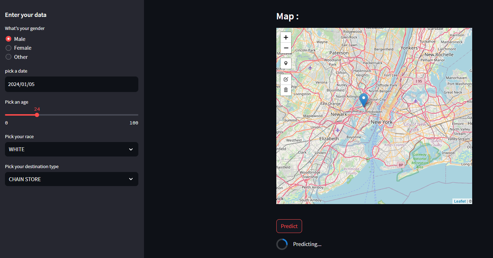
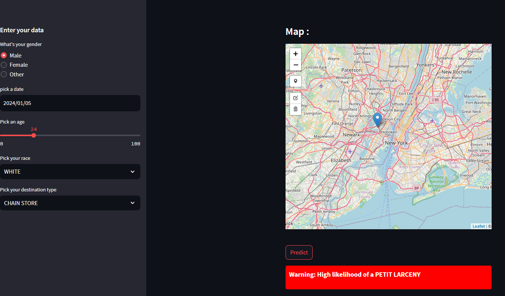

# NYC-Crime-Prediction
# Crime Prediction Project

## Overview

The Crime Prediction Project aims to predict the type of crime based on user input data, particularly latitude and longitude. This project leverages Streamlit for the user interface and Folium for geospatial mapping.

## Features

- Crime prediction based on user input data.
- Interactive map visualization using Folium.
- Streamlit for a user-friendly interface.

## Technologies Used

- Streamlit
- Folium

## How to Use

1. Clone the repository:

   ```bash
   git clone https://github.com/aymenhouidi/NYC-Crime-Prediction.git
   cd NYC-Crime-Prediction
2. Run the streamlit app :
      ```bash
   cd Frontend
   streamlit run main.py

3. Open your web browser and navigate to `http://localhost:8501`.

## Screenshots
<div style="display:flex;">


</div>


